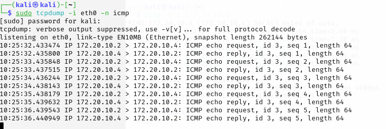
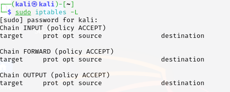
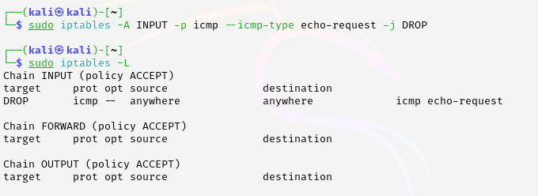
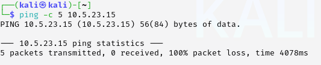
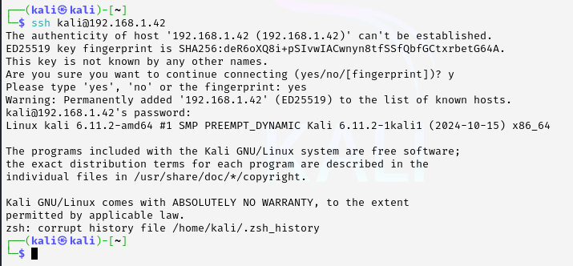
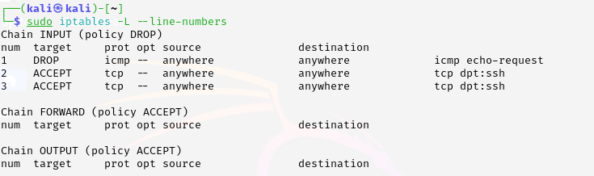
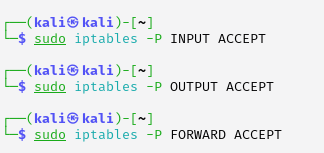

# Mini-Projet 1 : Fondamentaux et Identification/Authentification

PS : Le TP ayant été réalisé à différents moments et non d'une seule traite, les adresses IP des différentes machines ont changé en fonction du réseau sur lequel se trouvait la machine hôte.

## Partie 1-B : Mise en place d'une politique de mot de passe (complexité, renouvellement)

### Configuration de la politique de mot de passe
### Modification de `/etc/security/pwquality.conf`
```bash
sudo nano /etc/security/pwquality.conf
```
Ajout des paramètres :
```
minlen = 12
minclass = 4
ucredit = -1
lcredit = -1
dcredit = -1
ocredit = -1
maxrepeat = 3
maxsequence = 3
difok = 5
gecoscheck = 1
```


### Application via PAM
### Modification de `/etc/pam.d/common-password`
```bash
sudo nano /etc/pam.d/common-password
```
Ajout de :
```
password requisite pam_pwquality.so retry=3
password required pam_unix.so sha512 shadow nullok try_first_pass use_authtok
```


### Configuration du renouvellement des mots de passe
### Modification de `/etc/login.defs`
```bash
sudo nano /etc/login.defs
```
Configuration :
```
PASS_MAX_DAYS 90
PASS_MIN_DAYS 0
PASS_WARN_AGE 7
```


### Application à un utilisateur spécifique
```bash
sudo chage -M 90 kali
sudo chage -l kali
```


### Test de la politique de mot de passe
```bash
passwd  kali
```
Tests avec différentes contraintes :
- Trop court → refusé
- Sans chiffres → refusé
- Ne respectant pas toutes les classes → refusé
- Conforme aux règles → accepté


## Partie 1-C : Configuration de l'authentification SSH avec échange de clé

### Générer la paire de clés SSH (sur la VM Kali - client)
```bash
ssh-keygen
```
- Accepter l'emplacement par défaut.
- Définir une phrase secrète (passphrase) pour protéger la clé privée.


### Copier la clé publique vers le serveur (VM Ubuntu)
```bash
ssh-copy-id utilisateur@adresse_ip_ubuntu
```
- Saisir le mot de passe de l'utilisateur sur Ubuntu.


### Tester la connexion SSH par clé
```bash
ssh tdutrey@172.20.210.5
```


## Partie 1-D : Introduction aux outils d'attaque et de test (Wireshark, Nmap, etc.)

### Wireshark : Capture et Analyse de Base
### Générer du trafic réseau

Pour générer du trafic on utilise la commande Ping qui permet d'envoyer des paquets vers une adresse IP ciblé
```bash
ping -c 5 172.20.10.4
```


On repère les paquets depuis wireshark pour les analyser:


### Filtrage et Analyse des Paquets

Depuis Wireshark on filtre en tapant "ICMP" dans la barre du haut :


on remarque alors l'adresse IP source : 172.20.10.2 
ainsi que l'adresse IP de destination : 172.20.10.4

### Nmap : Scan de Ports de Base

- **Scan SYN des ports ouverts :**

Commande exécutée depuis la VM Attaquant :
```bash
nmap -sS 172.20.10.4
```


- **Détection des versions des services :**

Commande exécutée :
```bash
nmap -sV 172.20.10.4
```


### Autres Outils Utiles :

- **Capture avec tcpdump :**

Commande exécutée :
```bash
sudo tcpdump -i eth0 -n icmp
```


## Partie 1-E : Mise en place de protection basique (exemple : firewall basique)

### Prise en Main :
- **Vérification du Statut Actuel d'iptables :**

Pour afficher les règles iptables actuelles on tape cette commande :

```bash
sudo iptables -L
```


- **Mise en Place d'une Règle de Firewall Basique : Bloquer le Ping (ICMP INPUT) :**

L'objectif est simple, empêcher la VM de répondre aux requêtes Ping. Pour cela on éxecute cette commande :
```bash
sudo iptables -A INPUT -p icmp --icmp-type echo-request -j DROP
```
on vérifie ensuite avec :
```bash
sudo iptables -L
```


- **Test de la Règle : Ping depuis la VM Kali Cliente vers la VM Kali server :**

```bash
ping -c 5 10.5.23.15
```


- **Autoriser le Trafic SSH Entrant (TCP INPUT port 22) :**

 On execute la commande suivante :
 ```
sudo iptables -A INPUT -p tcp --dport 22 -j ACCEPT
```


- **Test de la Règle SSH : Connexion SSH depuis la VM Kali Client vers la VM Serveur :**

On essaie de se connecter en SSH à la VM Kali Server :
```bash
SSH kali@192.168.1.42
```


On remarque que l'on arrive bien à se connecter en SSH même si le ping est interdit.

- **Suppression des Règles iptables (Nettoyage) :**

On souhaite supprimer les règles en fonction de son numéro alors on affiche son numéro :
```bash
sudo iptables -L -v
```


Une fois toutes les lignes supprimées ou les commandes suivantes éxécutées, on se retrouve avec les règles initiales :

```bash
sudo iptables -D INPUT <numéro_de_ligne>
sudo iptables -F INPUT
```


**END**


