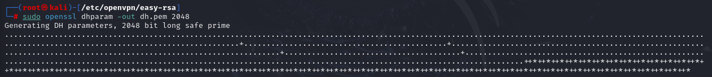
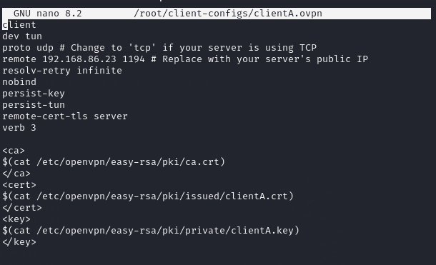
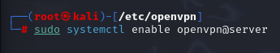

# Mini-Projet 2 : Contrôle d'Accès et Cryptographie

PS : Le TP ayant été réalisé à différents moments et non d'une seule traite, les adresses IP des différentes machines ont changé en fonction du réseau sur lequel se trouvait la machine hôte.

## Partie 2A : Configuration des permissions sur un système Linux.

### 1 - Création d'Utilisateurs et Groupes

Création de deux nouveaux utilisateurs.

Création d'un nouveau groupe.

Ajout d'un des utilisateur au groupe.

### 2 - Création de Fichiers et Répertoires de Test

Création d'un nouveau dossier de test.

Création d'un nouveau fichier texte.

Écriture du fichier texte.

### 3 - Affichage des Permissions Actuelles

Affichage des permissions du fichier texte.

Affichage des permissions du dossier de test.

### 4 - Modification des Permissions avec `chmod`

Définition d'`alice` en tant que propriétaire du fichier.

Attribution des droits de lecture et d'écritures (`rw-`) au propriétaire (`alice`), retrait des droits aux autres groupes et utilisateurs.

Changement du propriétaire du dossier test au groupe `dev`.

Attribution de tout les droits (lecture/écriture/exécution) au propriétaire du dossier (`dev`), retrait des droits aux autres groupes et utilisateurs.

 
### 5 - Changement de Propriétaire et de Groupe avec `chown` et `chgr`
Les fonctionnalités d'attribution de droits/possession à un utilisateur ou un groupe précis ont été présentées dans la partie précédente.

Attribution à l'utilisateur `alice` et au groupe `dev` le status de propiétaire du fichier texte.

### 6 - Vérifications

Vérification des attributions de droits pour le dossier et le fichier texte

 
 

## Partie 2B : Mise en place d'un chiffrement basique avec OpenSSL

### 1 - Préparation des Données

Création du contenu du fichier secret.

### 2 - Chiffrement du Fichier avec OpenSSL

Encryption du fichier secret via OpenSSL avec l'algorithme `AES-256-CBC` et le mot de passe `"ma_super_cle_secrete"`.

### 3 -  Visualisation du Fichier Chiffré

Affichage du contenu du fichier encrypté, résultant en un texte chiffré.

### 4 - Déchiffrement du Fichier avec OpenSSL

Déchiffrement du fichier encrypté, spécifiant l'algorithme et la clé utilisés.

### 5 - Vérification du Fichier Déchiffré 

Affichage du contenu du fichier déchiffré, contenant le texte original.

## Partie 2C : Création et manipulation de certificats auto-signés

### 1 - Génération d'une Clé Privée

Utilisation d'OpenSSL pour générer une clé privée secrète d'une taille de 2048 bits.

### 2 - Génération d'une Requête de Signature de Certificat (CSR)

Utilisation d'OpenSSL pour créer une requête de signature de certificat (`CSR`).

### 3 - Génération du Certificat Auto-Signé 

Signature du CSR en utilisant la clé privée générée précédement.

### 4 - Visualisation du Certificat

Affichage des données contenues dans le certificat en format textuel. 

 

### 5 - Manipulation des Certificats

Convertion du certificat du format `PEM` au format `DER`.

Extraction de la clé publique depuis le certificat.

## Partie 2D : Mise en place d'un VPN (OpenVPN) 

### 1 - Installation d'OpenVPN

Vérification de l'installation et de la version d'``OpenVPN`` et du module `easy-rsa` sur la machine virtuelle.

### 2 - Configuration du Serveur OpenVPN

Création du dossier `server` dans le dosser `openvpn`.

Copie des fichiers de configuration server dans le dossier créé.

### 3 -  Génération des Clés et des Certificats pour le Serveur
- Initialisation du dossier et des outils `easy-rsa`

- Création de l'autorité de certification 

- Création du certificat du serveur

- Génération des paramètres Diffie-Hellman

- Copie des clés et certificats dans le dossier `openvpn`

- Adaptation des droits `root`

### 4 -  Configuration du Client VPN

Création du certificat de `ClientA`.

Vérification des fichiers d'authentification de `ClientA` du côté serveur.

Contenu du fichier `ClientA.ovpn`.
 

Tranfer réussi des fichiers relatif à `ClientA` sur la machine client.

### 5 - Démarrage du Serveur OpenVPN

Édition du fichier de configuration serveur 

Autorisation et démarrage du service `OpenVPN` sur la machine serveur.

Confirmation du fonctionnement du service.

### 6 - Connexion du Client VPN

Confirmation de la connection du client au service avec l'argument `Initialization Sequence Completed` 

**END**

