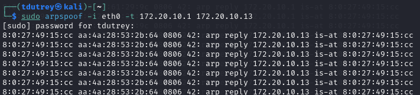

# Mini-Projet 3 : Network and Web Application Attacks

## Partie 3A : Mise en place d'une attaque ARP spoofing.

## 1. Préparation de l'Environnement

### Machines Virtuelles
Nous avons utilisé trois machines virtuelles :
- **Attaquant** : Kali Linux
- **Analyseur** : Kali Linux (Wireshark)
- **Victime** : Ubuntu

Les machines sont connectées sur le même réseau (réseau interne).

### Vérification du Réseau
#### Adresse IP et Connectivité
Nous avons vérifié les adresses IP et la connectivité entre les machines avec les commandes suivantes :

```bash
ifconfig  
ping <ip_victime>
ping <ip_passerelle>
```

**Capture d'écran de la configuration réseau  :**


---

## 2. Compréhension Théorique : ARP Spoofing

### Le protocole ARP
ARP (Address Resolution Protocol) permet de lier une adresse IP à une adresse MAC pour la communication réseau locale.

### Principe de l'attaque ARP Spoofing
L'attaquant envoie de fausses réponses ARP pour rediriger le trafic de la victime vers lui, le plaçant en *Man-in-the-Middle*.

---

## 3. Implémentation de l'Attaque ARP Spoofing

### Identification des Cibles
Sur la VM *Attaquant*, nous identifions les IPs de la victime et de la passerelle :

```bash
route -n  # Pour trouver l'IP de la passerelle
arp -a  # Pour voir les adresses MAC connues
```

**Capture d'écran des adresses IP et MAC avant attaque :**


### Lancement de l'attaque
Dans deux terminaux sur l'attaquant, nous exécutons :

```bash
sudo arpspoof -i eth0 -t <ip_victime> <ip_passerelle>
```
```bash
sudo arpspoof -i eth0 -t <ip_passerelle> <ip_victime>
```

**Capture d'écran des commandes arpspoof :**


---

## Partie 3B : Capture et Analyse de Trafic avec Wireshark

Nous analysons le trafic intercepté avec Wireshark.

```bash
wireshark
```

Nous filtrons sur le protocole `arp` pour voir les requêtes falsifiées.

**Capture d'écran de Wireshark montrant le trafic ARP :**


Interprétation des Données Capturées

1. **Protocole capturé : ARP**
   - ARP (Address Resolution Protocol) permet d’associer des adresses IP à des adresses MAC.
   - Nous voyons plusieurs requêtes ARP envoyées par un appareil sur le réseau.

2. **Adresse IP concernée : 172.20.10.1**
   - Il s'agit de l'adresse IP de la passerelle (routeur).

3. **Problème détecté : Duplication d'adresse IP**
   - Wireshark affiche un avertissement : *duplicate use of 172.20.10.1 detected!*.
   - Cela signifie que plusieurs machines revendiquent cette adresse avec des MAC différentes.
   - C'est un signe typique d’une attaque **ARP Spoofing**, où l’attaquant (PCSystemtec_49:15:...) usurpe l’adresse de la passerelle.

### Conclusion de l’Analyse
✔ **L'attaque ARP Spoofing fonctionne correctement.**  
   - L'attaquant a réussi à envoyer des requêtes ARP falsifiées.  
   - La victime croit que l’attaquant est la passerelle, ce qui redirige son trafic vers lui.  

✔ **Indicateurs visibles dans Wireshark :**
   - L'adresse MAC **08:00:27:49:15:cc** est associée à **172.20.10.1**, ce qui est suspect.
   - Des requêtes ARP répétitives montrent une tentative d’empoisonnement de la table ARP.

---

# Partie 3C : Exploitation de failles Web sur Metasploitable


## 1. Déploiement de la VM Metasploitable
### Téléchargement et installation
- Téléchargement de Metasploitable 2 depuis [SourceForge](https://sourceforge.net/projects/metasploitable/files/Metasploitable2/).
- Décompression de l'archive `.zip`.
- Importation du fichier `.vmdk` dans VirtualBox.
- Configuration du mode réseau sur "Réseau interne".
- Démarrage de la VM.

### Vérification de l'adresse IP
Connexion à la VM avec :
```
Nom d'utilisateur : msfadmin
Mot de passe : msfadmin
```
Puis exécution de la commande :
```bash
ifconfig
```
**Résultat :** 

Adresse IP de la VM : `172.20.10.14`

---

## 2. Exploitation d'une vulnérabilité XSS
### Identification de la cible
- Accès à l'application DVWA : `http://172.20.10.14/dvwa/`
- Connexion avec `admin/password`
- Réglage du niveau de sécurité sur "Low"

- Accès à la section "XSS (Reflected)"

### Attaque XSS
Injection de la charge :
```html
<script>alert("XSS");</script>
```
**Résultat attendu :** Une boîte d'alerte s'affiche avec le message "XSS".


**Autre payload (redirection) :**
```html
<script>window.location='http://www.google.com';</script>
```


---

## 3. Exploitation d'une vulnérabilité SQL Injection
### Identification de la cible
- Accès à la section "SQL Injection" de DVWA
- Présence d'un champ "User ID"

### Attaque SQL
Injection de la charge :
```sql
1' or '1'='1
```
**Résultat attendu :** Affichage de toutes les entrées de la base de données.


**Autre payload (affichage des tables) :**
```sql
1' union select table_name from information_schema.tables where table_schema = database()#
```

---

## 4. Observations et Compréhension
### Analyse des failles
- **XSS** : L'application ne filtre pas les entrées utilisateur, permettant l'injection de scripts malveillants.
- **Injection SQL** : La requête SQL de DVWA est vulnérable car elle ne valide pas correctement les entrées.

### Conséquences possibles
- **XSS** : Vol de cookies, défiguration de sites, attaques de phishing.
- **Injection SQL** : Accès non autorisé aux bases de données, exfiltration d'informations sensibles.

---
# Partie 3D : Test d'une application web avec Burp Suite

## 1. Installation et Lancement de Burp Suite

### Lancement

```bash
burpsuite
```

## 2. Configuration du Navigateur Web

### Paramétrage du Proxy (Firefox)

1. Ouvrez Firefox
2. Accédez aux "Settings"
3. Recherchez "proxy"
4. Sélectionnez "Manual proxy configuration" et entrez :
   - **HTTP Proxy** : `127.0.0.1`
   - **Port** : `8080`
   - Cochez "Use this proxy server for all protocols"
5. Cliquez sur "OK"

### Installation du Certificat Burp Suite

1. Accédez à `http://burp`
2. Téléchargez le certificat CA
3. Importez-le dans Firefox via "View Certificates" > "Authorities"
4. Cochez "Trust this CA to identify websites"

---

## 3. Interception des Requêtes HTTP

### Accès à l'Application Web

1. Allez à `http://172.20.10.14/dvwa`
2. Connectez-vous avec :
   - **Login** : `admin`
   - **Mot de passe** : `password`
3. Activez l'onglet "Proxy" > "Intercept" dans Burp Suite


---

## 4. Analyse et Modification de Requêtes

### Analyse

- Observez l'URL, la méthode HTTP et les paramètres
- Consultez les onglets "Params", "Headers" et "Request"

 **J'essaye d'accéder à "Instructions"**

 **On observe qu'on a intercepté des requêtes, j'appuie sur forward pour la valider**

**On accède à la page**


### Modification

1. Envoyez une requête au "Repeater"

2. Modifiez un paramètre GET ou POST

3. Cliquez sur "Send" et observez la réponse

On observe que la page n'est plus reconnue après avoir changer un paramètre.

**Exemples :**

#### Injection SQL

1. Accédez à la page "SQL Injection"
2. Entrez `1` et interceptez la requête

3. Modifiez `id=1` en `id=1' or '1'='1` et envoyez-la

Problème dans cette partie car les injections sql ne fonctionnaient plus sur le site metasploit, on voyait donc la page après avoir modifier le paramètre id mais on ne voyait pas le résultat de l'injection.


## 5. Désactivation du Proxy

- Dans Firefox, remettez "Use system proxy settings" pour restaurer l'accès Internet

---


**Fin du rapport**


