# Mini-Projet 4 : Sécurité des Réseaux et Tests d'Intrusion

PS : Le TP ayant été réalisé à différents moments et non d'une seule traite, les adresses IP des différentes machines ont changé en fonction du réseau sur lequel se trouvait la machine hôte.

## Partie 4A : Configuration d'un firewall basique

### Mise en Place des VMs :

Pour ce Mini-Projet, nous utilisons 3 VM :

- 2 VM Kali (1 Attaquant et 1 Analyseur).
- 1 VM Ubuntu (Victime).

Les étapes qui suivent on été effectués sur les 3 VM.

#### Désactivation temporaire du pare-feu :

```bash
sudo iptables -F
```

### Contenu pratique :

#### Vérification de l'état du pare-feu:

```bash
sudo iptables -L -v
```

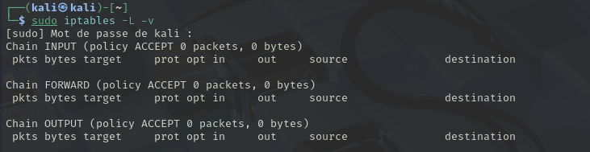

On peut voir qu'il n'y a pas de règles en place.

#### Définir les règles de base :

```bash
sudo iptables -P INPUT DROP
```

```bash
sudo iptables -P OUTPUT ACCEPT
```

Cela permet de refuser tout le trafic entrant par défaut et d'autoriser tout le trafic sortant.

#### Autoriser le trafic SSH :

```bash
sudo iptables -A INPUT -p tcp --dport 22 -j ACCEPT
```

#### Autoriser le trafic loopback :

```bash
sudo iptables -A INPUT -i lo -j ACCEPT
```

```bash
sudo iptables -A OUTPUT -o lo -j ACCEPT
```

#### Autoriser le trafic entre les 3 VMs :

Dans notre cas :

```bash
sudo iptables -A INPUT -s 192.168.86.0/24 -j ACCEPT
```

#### Autoriser ou bloquer d'autres services si nécessaire :

Par exemple, on autorise le trafic web sur le port 80.

```bash
INPUT -p tcp --dport 80 -j ACCEPT
```

On peut aussi bloquer un port spécifique, comme ici le port 3389. Dans ce cas cela n'a pas grande utilité, mais c'est pour la démonstration.

```bash
sudo iptables -A INPUT -p tcp --dport 3389 -j DROP
```

#### Enregistrer les règles :

```bash
sudo apt-get install iptables-persistent
```

```bash
sudo dpkg-reconfigure iptables-persistent
```

Ces deux commandes permettent d'installer et de lancer l'outil pour rendre les règles persistentes.

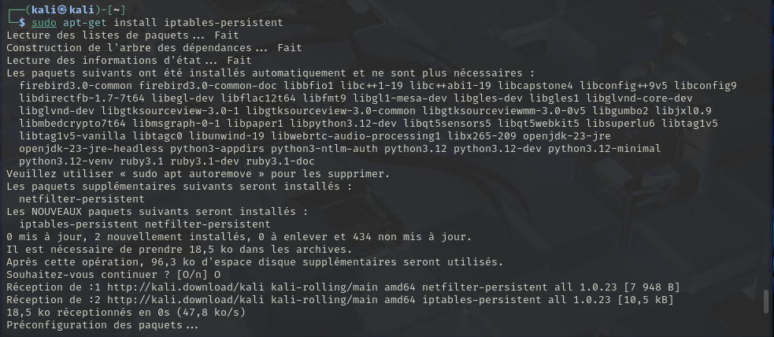

#### Vérification :

```bash
sudo iptables -L -v
```

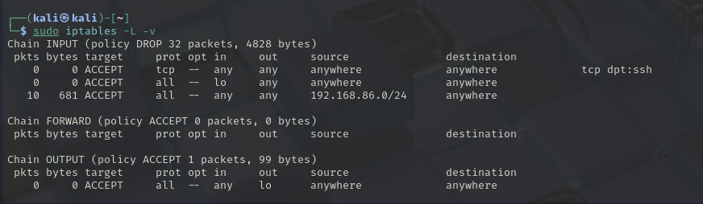

On peut voir que les règles que nous avons défini apparaissent bien.

#### Tests :

La connectivité entre les trois VMs fonctionnent bien, donc nous avons bien configuré le firewall.

## Partie 4B : Mise en place et utilisation d'un IDS (Snort, Suricata).

Dans cette partie, nous allons mettre en place un système de détection d'intrusion (IDS) (Snort dans notre cas) et comprendre son rôle dans la surveillance du réseau.

### Installation de Snort :

```bash
sudo apt update && sudo apt install snort
```

Cette commande lance l'installation de Snort3 sur notre VM Kali Analyseur.
Comme nous utilisons Snort3, les commandes et configurations peuvent différer un petit peu en comparaison avec Snort2.

### Configuration de Snort (fichier snort.lua ) :

Le fichier de configuration de Snort est situé dans `/etc/snort/snort.lua`.
On ouvre le fichier de configuration :

```bash
sudo nano /etc/snort/snort.lua
```

Dans la partie 5 de notre fichier (5. configure detection), nous allons rajouter ceci :

```bash
ips =
{
    rules = [[
        include /usr/local/etc/snort/rules/local.rules
    ]]
}
```

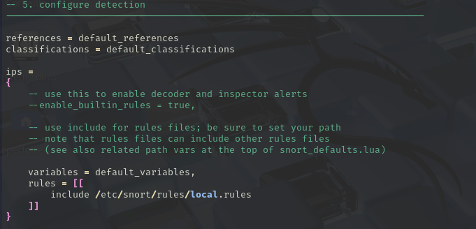

Notre but est de détecter si un ping ou un nmap est effectué par la VM Attaquante sur la VM cible.
On va donc créer des règles dans le fichier `/etc/snort/rules/local.rules` pour pouvoir détecter ceci .

Voici les règles quue nous allons ajouter au fichier :

```bash
alert icmp any any -> any any (msg:"ICMP Echo Request detected"; sid:1000001; rev:1;)
alert tcp any any -> any any (msg:"Nmap Scan Detected"; flags:S; sid:1000002; rev:1;)
```

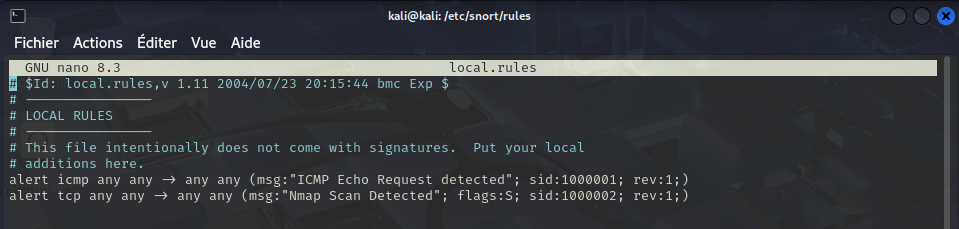

### Lancer Snort en mode détection :

```bash
sudo snort -c /etc/snort/snort.lua -i eth0 -A full
```

`-i eth0` permet de préciser l'interface réseau sur laquelle on veut intercepeter l'attaque.
`-A full` permet de préciser le format des alertes que nous voulons afficher.

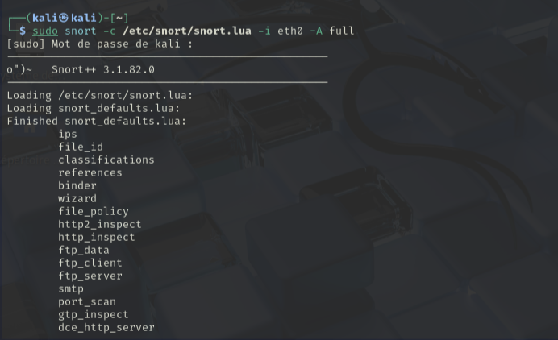

En parallèle, on va effectuer un ping depuis la VM attaquante vers la VM victime.

```bash
ping -c 4 192.168.86.28
```

Cela va être détecté, et affiché dans les logs :

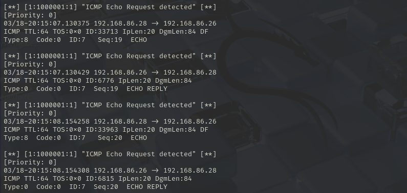

On peut voir 4 pings.
Cela fonctionne pareil pour les nmap :

```bash
nmap -p 1-1000 192.168.86.28
```

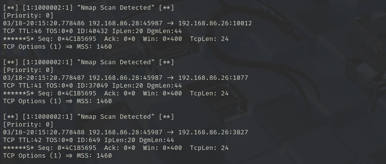

On arrive bien à intercepter les nmap.

## Partie 4C : Scan de ports et de services avec Nmap.

Dans cette partie, nous allons effectuer des nmap de la VM attaquante vers la VM victime.

### Scans de ports basiques (TCP SYN scan) :

```bash
nmap -sS 192.168.86.29
```

Avec `-sS` qui effectue un scan TCP SYN (scan furtif).

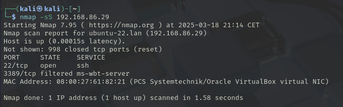

### Scan de ports spécifique :

```bash
nmap -p 22,80,443 192.168.86.29
```

```bash
nmap -p 1-1000 192.168.86.29
```

Avec `-p` qui permet de spécifier les ports à scanner.

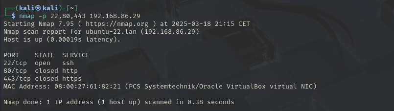
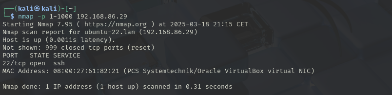

### Détection de services (Service Version Detection) :

```bash
nmap -sV 192.168.86.29
```

Avec `-sV` qui active la détection des versions de services.

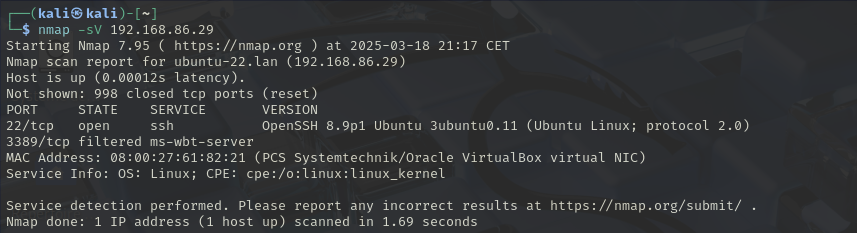

### Scan de l'OS (Operating System Detection) :

```bash
nmap -O 192.168.86.29
```

Avec `-O` qui active la détection de l'OS

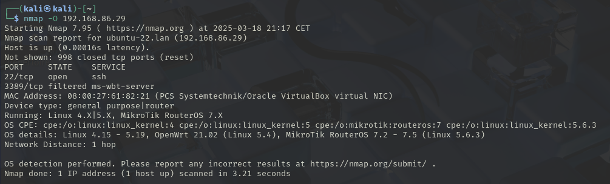

### Combiner les options :

On va pouvoir combiner toutes les options que l'on a vu précédemment en une commande.

```bash
nmap -sS -sV -O -p 1-65535 192.168.86.29
```

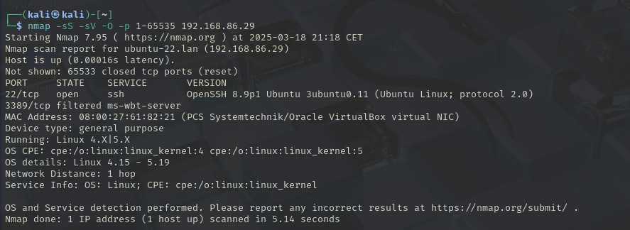

### Analyse des résultats :

Voici les informations que ce nmap nous donne :

- État de l'hôte : Actif (latence : 0.00016s)
- Ports scannés : 1 à 65535
- Ports ouverts :
  - 22/tcp (SSH) → Service OpenSSH 8.9p1 (Ubuntu)
- Ports filtrés :
  - 3389/tcp (ms-wbt-server) → Probablement lié à Remote Desktop Protocol (RDP)
- Autres ports : Fermés (65533 ports non accessibles)
- Adresse MAC : 08:00:27:61:82:21 (VirtualBox NIC)
- Type d'appareil : Machine virtuelle / Usage général
- OS détecté : Linux (Kernel 4.x - 5.x)
- Distance réseau : 1 saut

## Partie 4D : Mise en place d'une attaque simple (scan de port).

### Scan de ports initial (reconnaissance) :

```bash
nmap -sS -sV -p 1-65535 192.168.86.29
```

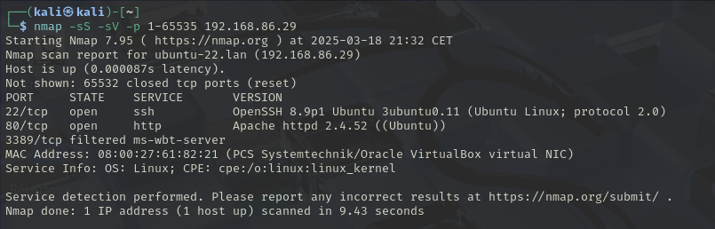

### Analyse des résultats du scan :

Ce scan Nmap nous permet d'identifier des service potentiellement vulnérable.
Tout d’abord, le port 22 (SSH) est ouvert et utilise OpenSSH 8.9p1. Bien que cette version soit relativement récente, elle pourrait présenter des vulnérabilités exploitables, notamment si des identifiants faibles sont utilisés, rendant une attaque par force brute envisageable. Ensuite, le port 80 (HTTP) est également ouvert et héberge un serveur Apache 2.4.52. Cette version du serveur web pourrait être vulnérable à certaines attaques, notamment si une application web mal sécurisée y est déployée.

### Mise en place de l'attaque (Exemple avec SSH) :

Pour ceci nous allons utiliser Hydra, un outil de force brute utilisé en cybersécurité pour tester les identifiants sur divers services (SSH, FTP, HTTP, etc.).
On utilise aussi RockYou.txt qui est un fichier de mots de passe (déjà présent sur Kali linux) couramment utilisé en cybersécurité pour les attaques par force brute et le pentesting.

```bash
hydra -l ubuntu -P /usr/share/wordlists/rockyou.txt.gz ssh://192.168.86.29
```

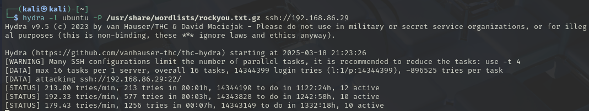

### Mise en place de l'attaque (Exemple avec Web) :

Pour ceci on utilise Dirb, un outil de scan web qui détecte des répertoires et fichiers cachés en testant des listes de mots prédéfinies.

```bash
dirb http://192.168.86.29
```

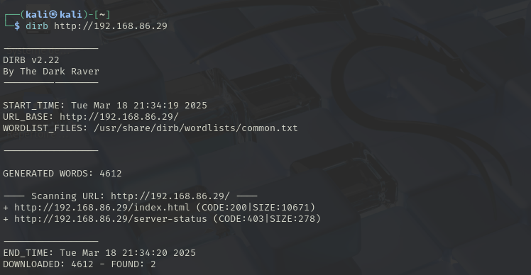

### Analyse des résultats de l'attaque et Production d'un rapport:

L'objectif de ces attaques était d'identifier des vulnérabilités potentielles sur la VM cible en se concentrant sur deux aspects principaux :

- Le service SSH (port 22) : Essayer d'obtenir un accès non autorisé à l'aide d'une attaque par force brute.

  - Résultat :
    L'attaque a été lancée contre le service SSH de la machine cible.
    Aucune réussite immédiate n’a été détectée, mais la tâche de force brute est en cours et pourrait aboutir sur une longue durée.
    Le taux d'essai varie entre 179 à 213 tentatives par minute, ce qui signifie que le processus peut prendre plusieurs heures, voire des jours, selon la robustesse du mot de passe de l'utilisateur "ubuntu".
  - Vulnérabilité :
    Si un mot de passe faible est utilisé, l’attaquant peut facilement obtenir un accès SSH à la machine et la compromettre totalement.

- Le service Web (port 80) : Identifier des fichiers ou répertoires sensibles via une attaque par énumération.
  - Résultat :
    Deux ressources ont été découvertes :
    - /index.html (Code 200 - Accessible)
    - /server-status (Code 403 - Accès interdit)
  - Vulnérabilité :
    La présence de server-status indique que le serveur Apache est configuré pour enregistrer l'état en temps réel, ce qui pourrait permettre à un attaquant d’obtenir des informations sensibles sur les requêtes en cours si l’accès était mal protégé.

Donc l’attaque a permis d’identifier plusieurs vulnérabilités potentielles sur la machine cible. Bien que l'attaque Hydra ne soit pas encore réussie, elle démontre que le service SSH est exposé à des attaques par force brute. L’analyse web a mis en évidence un point d'accès sensible, qui, s’il était mal configuré, pourrait révéler des informations critiques sur le serveur. Ces résultats soulignent l’importance de sécuriser les services accessibles depuis le réseau.

## Partie 4E : Introduction au pentest et la méthodologie.

Dans cette phase de notre projet, nous avons réalisé un test d'intrusion pour évaluer la sécurité d'une machine cible située sur un réseau local et identifier les vulnérabilités potentielles.

Le test a été effectué sur une machine virtuelle Ubuntu configurée avec les services SSH (port 22) et HTTP (port 80). Le périmètre du test a couvert les éléments suivants :

- SSH (Port 22) : Nous avons testé les mécanismes d'authentification par mot de passe pour déterminer si la machine était susceptible d'être compromise par une attaque par force brute.
- Serveur Web (Port 80) : Nous avons effectué une analyse du serveur HTTP pour découvrir d’éventuels fichiers sensibles ou mal protégés.

Nous avons utilisé plusieurs outils de sécurité pour mener à bien ce test d'intrusion :

- Nmap : Outil de scan de ports utilisé pour identifier les services actifs sur la machine cible. Nous avons effectué plusieurs types de scans pour obtenir des informations détaillées sur les services en écoute (SSH, HTTP) et leur version.
  - Scan SYN furtif pour identifier les ports ouverts et détecter les services en écoute.
  - Scan pour détecter les versions des services afin d'évaluer leur potentiel de vulnérabilité.
  - Scan de l'OS pour identifier le système d'exploitation et les configurations possibles liées à la sécurité.
- Hydra : Utilisé pour mener une attaque par force brute sur le service SSH. Cet outil a permis de tester différentes combinaisons d’utilisateurs et de mots de passe afin de déterminer si un mot de passe faible pouvait être exploité pour obtenir un accès non autorisé à la machine via SSH.
- Dirb : Outil de découverte de répertoires utilisé pour analyser le serveur Web et identifier d'éventuels répertoires ou fichiers sensibles comme des pages d'administration, des scripts de back-end ou des répertoires non protégés.
- OSINT (Open Source Intelligence) : Méthode complémentaire pour rechercher des informations publiques sur la machine cible, notamment par le biais de moteurs de recherche pour identifier des ressources supplémentaires pouvant aider dans l'attaque.

Une fois qu'un attaquant a accès au serveur, il pourrait mettre en place un backdoor (par exemple, en ajoutant un utilisateur ou en modifiant les clés SSH). Cela lui permettrait de revenir sur la machine même si la vulnérabilité initiale était corrigée. Le maintien de l'accès repose sur la persistance et la dissimulation de l'intrus.

Pour corriger les vulnérabilités identifiées, voici les actions recommandées :

- Renforcer la sécurité du service SSH :
  - Désactiver l'authentification par mot de passe et privilégier l'utilisation de clés SSH pour une authentification plus sécurisée.
  - Limiter le nombre de tentatives de connexion échouées (par exemple, via Fail2ban ou d'autres outils de protection contre les attaques par force brute).
  - Mettre en place un pare-feu pour restreindre l'accès SSH à certaines adresses IP ou sous-réseaux spécifiques.
- Sécurisation du serveur Web :
  - Désactiver ou restreindre l'accès à "/server-status" pour éviter la fuite d'informations sensibles. Cette page doit être protégée par un mot de passe ou complètement désactivée si elle n'est pas nécessaire.
  - Implémenter des mesures de sécurité supplémentaires, telles que l'utilisation de HTTPS (SSL/TLS) pour sécuriser les communications entre le client et le serveur Web.

Plusieurs chose peuvent être recommandés également :

- Mise à jour régulière des systèmes et logiciels : Les failles de sécurité peuvent souvent être corrigées par l’application de mises à jour logicielles. Veiller à ce que tous les services (Apache, OpenSSH, etc.) soient mis à jour régulièrement pour combler les éventuelles vulnérabilités connues.
- Formation continue en cybersécurité : Former les administrateurs système et les utilisateurs à la sécurité informatique, notamment en ce qui concerne les mots de passe, les bonnes pratiques de gestion des accès et la détection des tentatives d'attaques.
- Surveillance et détection d'intrusion : Installer des outils de surveillance réseau (comme Snort ou d'autres IDS/IPS) pour détecter toute tentative d'intrusion et réagir rapidement en cas d'attaque.
