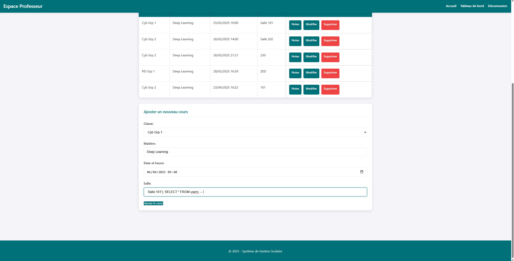
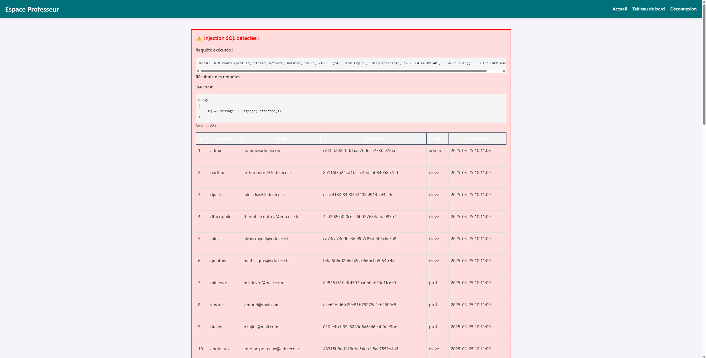
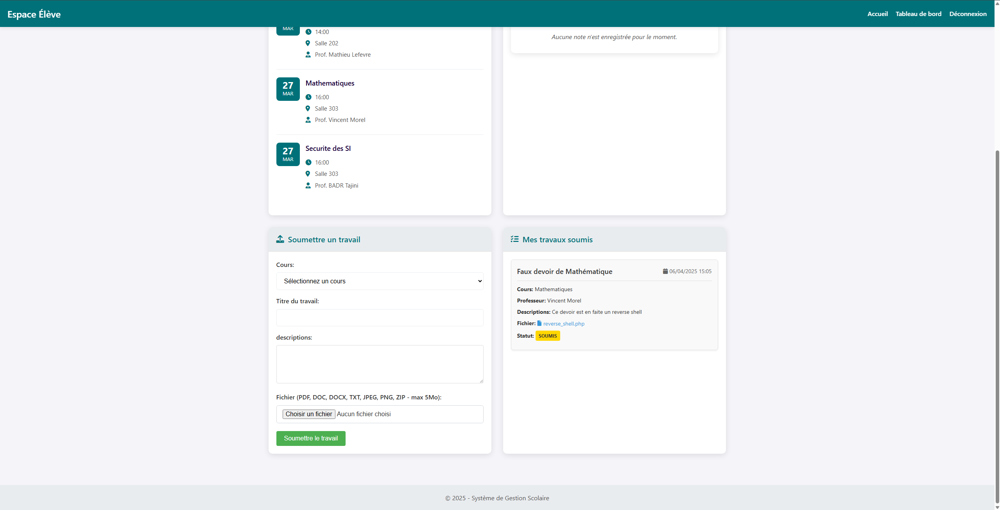

# Rapport détaillé sur le déploiement du site web

## Objectif

L'objectif est de déployer un site web (développé avec HTML, CSS, PHP et Docker) sur une machine virtuelle (VM) dans le cloud via Amazon Web Services (AWS). Ce déploiement doit permettre des mises à jour régulières du site à l'aide d'un script automatisé, en s'assurant que les modifications locales sont intégrées à la VM à chaque mise à jour.

---

## 1. Configuration du Virtual Private Cloud (VPC) sur AWS

Avant de créer la machine virtuelle (EC2), un **Virtual Private Cloud (VPC)** a été configuré. Le VPC permet d'isoler et de sécuriser les ressources du cloud, offrant un environnement réseau privé dans lequel les instances EC2 peuvent être lancées.

### 1.1 Création d'un VPC :
- Le VPC est une infrastructure réseau isolée qui permet de contrôler le trafic entrant et sortant entre les ressources dans le cloud AWS.
- **Plage d'adresses IP privées** : Une plage d'adresses IP privées a été définie pour le VPC, typiquement `10.0.0.0/16`. Cela définit l'ensemble des adresses IP que les ressources au sein du VPC peuvent utiliser.
- **Sous-réseau public et privé** : Un sous-réseau public a été créé pour héberger l'instance EC2, ce qui permet à cette instance d’être accessible depuis l'internet. Ce sous-réseau a été configuré avec une passerelle Internet (Internet Gateway), permettant aux instances EC2 de communiquer avec l'internet.

### 1.2 Table de routage :
- Le VPC est associé à une table de routage qui détermine comment le trafic doit être dirigé. La table de routage est configurée pour diriger le trafic vers la passerelle Internet (Internet Gateway) pour les ressources dans le sous-réseau public.
- **Route vers l'Internet Gateway** : Les instances dans le sous-réseau public peuvent accéder à l'internet grâce à cette route.

---

## 2. Création de la machine virtuelle (EC2) sur AWS

Après avoir configuré le VPC et les sous-réseaux, une instance EC2 a été créée et déployée dans le sous-réseau public du VPC.

### 2.1 Lancement de l'instance EC2 :
- **Image (AMI)** : L'instance EC2 a été lancée à partir de l'image Ubuntu Server 20.04, choisie pour sa compatibilité avec les technologies utilisées dans le projet (Docker, Apache, PHP).
- **Type d'instance** : Un type d'instance `t2.micro` a été sélectionné pour bénéficier du niveau gratuit d'AWS (si applicable), avec des ressources de base.
- **Clé SSH** : Une clé SSH privée a été générée et associée à l'instance afin de permettre un accès sécurisé à la machine via SSH.
- **VPC et sous-réseau** : L'instance EC2 a été déployée dans le VPC et sous-réseau publics précédemment configurés.

### 2.2 Configuration du groupe de sécurité :
- Le groupe de sécurité est un pare-feu virtuel pour contrôler le trafic réseau entrant et sortant des instances EC2.
- **Règles de groupe de sécurité** :
  - **Port 22 (SSH)** : Ouvert uniquement pour l'adresse IP de l'utilisateur, afin de permettre un accès SSH sécurisé à la VM.
  - **Port 80 (HTTP)** : Ouvert à partir de n'importe quelle adresse IP (`0.0.0.0/0`), afin de rendre le site web accessible publiquement.

### 2.3 Obtention de l'adresse publique :
- Pour se connecter à la machine virtuelle (VM) et accéder au site, il est nécessaire de connaître l'adresse IP publique de l'instance EC2.
- L'adresse IP publique peut être trouvée dans la console AWS, sous la section **"Instances EC2"**. Dans notre cas, l'adresse IP publique de l'instance est `35.180.94.78`.

### 2.4 Accès SSH :
L'accès à la machine virtuelle se fait via la clé privée SSH associée à l'instance EC2. Pour garantir la sécurité, il est impératif de restreindre les permissions sur la clé privée, afin que seule l'utilisateur qui doit se connecter à l'instance puisse l'utiliser. En effet, si les permissions de la clé privée sont trop larges, la connexion SSH sera bloquée. Il est donc important de réduire les droits d'accès à la clé privée pour les utilisateurs non autorisés.

#### Connexion SSH à l'instance EC2 :
Pour se connecter en SSH à l'instance EC2, on utilise la commande suivante dans le terminal (en remplaçant les chemins et les informations par les valeurs appropriées) :

```bash
ssh -i /chemin/vers/ta/clé/secu-si.pem ubuntu@35.181.168.33
```

Cela ouvrira une session SSH sur la machine virtuelle, où tu pourras déployer ton site ou effectuer toute autre tâche d'administration.


---

## 3. Création et configuration du Dockerfile

Une fois la VM en place, le Dockerfile a été configuré pour exécuter le site web sur un serveur Apache avec PHP.

### 3.1 Image Docker :
Une image Docker a été configurée à partir de `php:8.0-apache`, qui fournit à la fois un serveur Apache et un interpréteur PHP. Le fichier `Dockerfile` utilisé pour la construction de l'image contient les instructions suivantes :
```dockerfile
# Utiliser une image officielle de PHP avec Apache
FROM php:8.0-apache

# Définir le répertoire de travail
WORKDIR /var/www/

# Copier les fichiers de ton projet dans le conteneur
COPY . /var/www/

# Activer les extensions PHP nécessaires (ex: mysqli, pdo_mysql si tu utilises une BDD)
RUN docker-php-ext-install pdo pdo_mysql mysqli

# Modifier les permissions si nécessaire
RUN chown -R www-data:www-data /var/www/html/

# Exposer le port 80 pour Apache
EXPOSE 80
```

- Cette image Docker utilise PHP et Apache pour servir le site web.
- Les fichiers du site sont copiés dans le répertoire `/var/www/html/` du conteneur Docker.
- Les permissions des fichiers sont modifiées pour s'assurer que l'utilisateur Apache (www-data) a l'autorisation de lire et d'écrire dans ces fichiers.
- Le port 80 est exposé pour que le site web soit accessible via HTTP.

### 3.2 Docker Compose :
Pour simplifier le déploiement du site web, un fichier `docker-compose.yml` a été créé pour définir les services nécessaires (Apache, PHP, MySQL, etc.) et les liens entre eux. Voici un exemple de fichier `docker-compose.yml` pour un site web PHP avec Apache :

```yaml
services:
  web:
    build: .
    env_file:
      - .env
    container_name: site-web-secussi
    ports:
      - "80:80"
    volumes:
      - .:/var/www/html
    depends_on:
      - db
    environment:
      - APACHE_RUN_USER=#1000
      - APACHE_RUN_GROUP=#1000
    restart: always
  db:
      image: mysql:8.0
      container_name: mysql-db
      restart: always
      environment:
        MYSQL_ROOT_PASSWORD: rootXfo9_72fQ-t2
        MYSQL_DATABASE: ece_db
        MYSQL_USER: user
        MYSQL_PASSWORD: nv7_4f8X.g1qPPP
      ports:
        - "3306:3306"
      volumes:
        - mysql_data:/var/lib/mysql
        - ./config/init.sql:/docker-entrypoint-initdb.d/init.sql


volumes:
  mysql_data:
```

Si vous souhaitez déployer notre projet en local sur votre machine remplacez :
```yaml
ports:
      - "80:80"
```
par :
```yaml
ports:
      - "8080:80"
```

Puis faites un :
```bash
docker-compose up -d --build
```

---

## 4. Déploiement du site sur la machine virtuelle

### 4.1 Script de déploiement : `deploy.sh`

Un script shell, `deploy.sh`, a été créé pour automatiser le déploiement du site sur la machine virtuelle à chaque mise à jour du dépôt Git.

```bash
#!/bin/bash

# Déplacement dans le dossier du projet
cd /home/ubuntu/SecSI_2025/Projet/BlueTeam/ECE_website_unpatched

# Mise à jour du code source
git pull origin main

# Arrêter et supprimer les anciens conteneurs proprement
docker-compose down
# Ou pour retirer le volume persistant
#docker-compose down -v

# Reconstruction et redémarrage des conteneurs en arrière-plan
docker-compose up -d --build

# Nettoyer les anciennes images Docker inutilisées
docker image prune -f

# Vérifier que les conteneurs tournent bien
docker ps
```

### 4.2 Authentification Git et permissions SSH

Le script utilise un **Personal Access Token (PAT)** pour éviter d'avoir à saisir les identifiants Git à chaque exécution du script. De plus, pour assurer une connexion sécurisée à la machine virtuelle, les permissions de la clé SSH privée ont été ajustées avec la commande `chmod 600`.

---

## Conclusion de la partie 4 Server 

Le site web est désormais déployé sur une machine virtuelle AWS, accessible via le port 80. Cette VM fonctionne en réalité comme un VPS (Virtual Private Server), offrant un environnement dédié avec un système d'exploitation complet et des ressources indépendantes. Cela nous permet de gérer notre serveur comme un serveur dédié tout en profitant des avantages du cloud et permettant de laisser certaines failles pour la Red Team. Le processus de déploiement a été automatisé grâce au script `deploy.sh`, qui gère la mise à jour du code, la reconstruction de l'image Docker et le redémarrage du conteneur. Le VPC a permis de sécuriser le réseau et de configurer l'accès public à l'instance EC2. 

---

## 5. Création du site web avec HTML, CSS et PHP

Le site web a été développé en utilisant HTML, CSS et PHP pour créer une interface utilisateur interactive et dynamique. Le site contient plusieurs pages, dont une page d'accueil, une page prof, élève, admin et même un calendrier. Le site est hébergé sur un serveur Apache avec PHP, permettant d'exécuter des scripts PHP côté serveur pour interagir avec la base de données et générer du contenu dynamique.

Voici la structure du site web :

```
.
├── config
│   ├── db.php
│   ├── db_vulnerable.php
│   ├── init.sql
│   └── php.ini
├── css
│   └── style.css
├── docker-compose.yml
├── Dockerfile
├── images
│   ├── admin.jpg
│   ├── eleve.jpg
│   └── prof.jpg
├── includes
│   ├── footer.php
│   └── header.php
├── index.php
├── login
│   └── login.php
├── pages
│   ├── admin.php
│   ├── cal.php
│   ├── eleve.php
│   ├── index.php
│   └── prof.php
└── README.md
```

- Le dossier `config` contient les fichiers de configuration pour la base de données et PHP.
- Le dossier `css` contient les fichiers de style CSS pour personnaliser l'apparence du site.
- Le dossier `images` contient les images utilisées sur le site.
- Le dossier `includes` contient les fichiers (footer et header) PHP inclus dans plusieurs pages pour réutiliser du code.
- Le dossier `login` contient le formulaire de connexion pour les utilisateurs.
- Le dossier `pages` contient les différentes pages du site (accueil, prof, élève, admin, calendrier).

---

## 6. Une fois le site deployé

Avec toutes ces ressources nous avons pu correctement déployer notre site web de manière public en utilisant ce lien (normalement inactif à partir du 6 Avril 2025) :

http://35.180.94.78

Pour "aiguiller" le travail de la RED Yeam, la Purple Team a rédigé un document donnant des informatiosn sur l'interface web que nous avons développé.
Ce lot d'informations est consultable dans le dossier `Purple Team` sous le nom `situation.md`.
---

## 7. Respect des normes OWASP Top 10 2021

### 6.1. A01:2021 - Broken Access Control ✅ Respecté
Le site implémente des contrôles d’accès pour limiter l’accès à certaines pages en fonction du rôle des utilisateurs (ex. professeurs, élèves, administrateurs). Cependant, la faiblesse liée à Patrick Fourtou (mot de passe faible) peut permettre un accès non autorisé si un attaquant réussit à prendre son compte.

Recommandation supplémentaire :

Vérifier systématiquement les autorisations côté serveur avant d’afficher une page protégée.

Implémenter un mécanisme de vérification des sessions pour éviter l'usurpation d’identité.

### 6.2. A02:2021 - Cryptographic Failures ❌ Non appliqué
Deux problèmes majeurs compromettent la sécurité cryptographique :

Stockage des mots de passe en MD5, un algorithme obsolète et non sécurisé.

Absence de chiffrement HTTPS, ce qui expose les données sensibles en clair sur le réseau.

Recommandation :

Remplacer MD5 par bcrypt ou Argon2 pour stocker les mots de passe.

Mettre en place un certificat SSL et forcer le passage en HTTPS.

### 6.3. A03:2021 - Injection ❌ Non appliqué
- **Première faille :**

Utilisation des requêtes préparées avec PDO pour éviter l’injection SQL. Ceci est fait dans la page db.php et l'ensemble du site sauf la page `prof.php` qui n'utilise pas de PDO mais qui emploie la méthode `mysqli`.

Méthode PDO :
```php
<?php
$host = getenv('DB_HOST');
$dbname = getenv('DB_NAME');
$username = getenv('DB_USER');
$password = getenv('DB_PASS');

try {
    $pdo = new PDO("mysql:host=$host;dbname=$dbname;charset=utf8", $username, $password);
    $pdo->setAttribute(PDO::ATTR_ERRMODE, PDO::ERRMODE_EXCEPTION);
} catch (PDOException $e) {
    die("Connexion échouée : " . $e->getMessage());
}
?>
```

Méthode mysqli :
```php
<?php
function getVulnerableConnection() {
    $host = getenv('DB_HOST');
    $dbname = getenv('DB_NAME');
    $username = getenv('DB_USER');
    $password = getenv('DB_PASS');
    
    // Créer une connexion mysqli qui permet les requêtes multiples
    $mysqli = new mysqli($host, $username, $password, $dbname);
    
    if ($mysqli->connect_error) {
        die("Connexion échouée : " . $mysqli->connect_error);
    }
    
    return $mysqli;
}
?>
```

⚠️ La page prof.php est vulnérable aux injections SQL via l’input "salle", ce qui permettrait à un attaquant de manipuler la base de données.

Pour récupérer les informations de la table `users`, un attaquant pourrait/devrait utiliser une requête SQL malveillante comme suit :

```sql
 Salle 101'); SELECT * FROM users; -- 
```
Dans l'input salle





**Recommandation :**

Utiliser des requêtes préparées avec PDO/MySQLi.

Échapper et valider toutes les entrées utilisateur.

- **Deuxième faille :**

Possibilité d'injéction XSS/LFI dans la page élève. La RED Team devra parvenir à obtenir l'identifiant d'un élève à partir du fichier `situation.md` qui leur a été communiqué (partie OSINT) et accéder à cette page.

Une fois l'accès à la page obtenue, la RED Team devra effectuer des tests pour vérifier que la seule entrée de fichiers du site est bien sécurisée. Il devront alors remarquer que la phrase "Fichier (PDF, DOC, DOCX, TXT, JPEG, PNG, ZIP - max 5Mo):" n'est que un avertissement car aucune vérificétion n'est faite sur le type de fichier. 
Il est donc possible de faire une injection LFI pour potentiellement exécuter du code sur le docker hébergeant notre site :



**Recommandation :**

- Instaurer une with liste pour vérifier les type de fichiers autorisés;
- Définir des fonctions et appelle de fonctions "interdites" dans nos fichiers php.
- Réduire les droits de nos conteneurs.


### 6.4. A04:2021 - Insecure Design ✅ Respecté
Le site suit une certaine structure logique avec des rôles bien définis et des fichiers de configuration sécurisés. Notaement avec le fichier `php.ini` et `.htaccess`.


### 6.5. A05:2021 - Security Misconfiguration ✅ Respecté
Le site est correctement configuré sur son serveur Apache et PHP. L’affichage des erreurs en production a été désactivé.

**Recommandation :**

Mettre en place snort sur le serevr pour détecter les attaques.

### 6.6. A06:2021 - Vulnerable and Outdated Components ✅ Respecté
Le site utilise une version récente de PHP et n’emploie pas de bibliothèques connues pour contenir des vulnérabilités.

**Amélioration possible :**

Mettre en place un système de mise à jour automatique des dépendances.

### 6.7. A07:2021 - Identification and Authentication Failures 🟠 Faiblesse
Toutes les authentifications et accès aux pages snesibles sont sécurisées.
Cepednant le mot de passe faible de Patrick Fourtou et le stockage en MD5 constituent une vulnérabilité.

**L'utilisateur Patrick Fourtou utilise le mot de passe "password", qui est extrêmement faible et facilement devinable.**

Un attaquant pourrait exploiter cette faiblesse en utilsiant du brutforce pour se connecter à son compte et accéder aux pages restreintes associées à ce profil.
L'individu est aussi décrit comme une personne qui se fait facilement piéger par des attaques de phishing.

**Recommandations :**

Ajouter une protection contre le bruteforce (ex. limiter les tentatives de connexion).

### 6.8. A08:2021 - Software and Data Integrity Failures ✅ Respecté
Le site ne repose pas sur des mises à jour logicielles non vérifiées, ce qui réduit le risque d’injection de code malveillant.


### 6.9. A09:2021 - Security Logging and Monitoring Failures ✅ Respecté
Le site enregistre les tentatives de connexion et certaines activités sensibles.

Recommandation :

Ajouter un système d’alertes en cas d’activité suspecte.

### 6.10. A10:2021 - Server-Side Request Forgery (SSRF) ✅ Respecté
Le site ne permet pas d’envoyer des requêtes vers des URL externes à partir d’inputs utilisateur, ce qui réduit le risque de SSRF.


